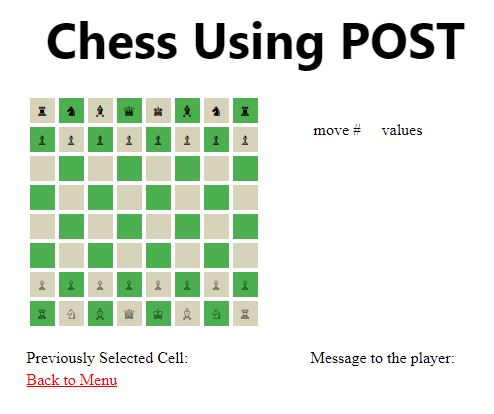
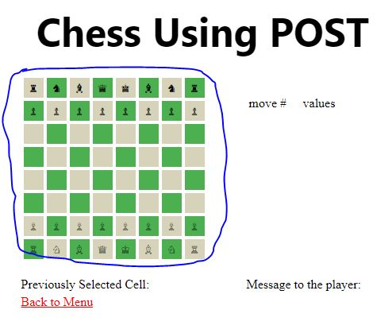
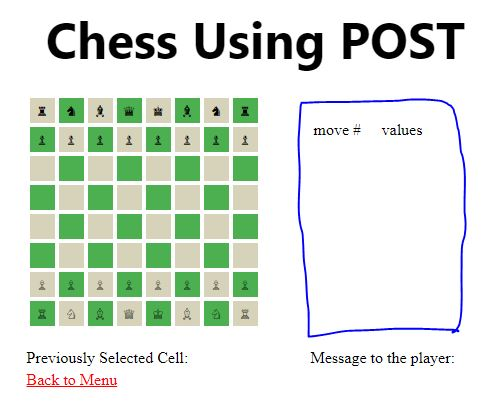
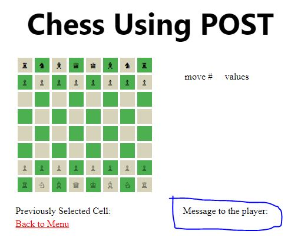
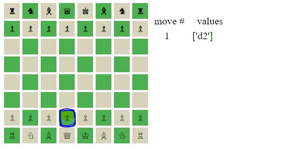

# Readme Project Plan

Abstract: 
To have a chess game with an HTML user interface as well as a CHESS AI to allow for users to play against the computer. (A majority of the original chess game was made during the first 6 weeks of the trimester, however along with the chess ai, there were a few parts that we worked on during the last 6 weeks.)
As this was a huge scope we split the project into two:

## Chess with HTML interface:
A port of the original ASCII chess game to a html user experience. This project is a test of understanding POST and how to tie python code (backend/ what the user cannot see) with jinja to the HTML (front end/what the user can see). Here was the original Ascii Chess Game (where all of the backend logic came from): https://repl.it/@KyleMyint/ASCII-Chess#0README.md. 

As one can see the input of having the user type in the start and end square was very tedious and hard for new players to understand how to move the pieces. We wanted to create a more intuitive user interface. As seen here:

## Chess AI: 

Delving deep into the logic of code creating the chess AI allows the team to understand the concept of creating a bot and training it. We emphasize certain aspects as a priority to others. Without user input, the chess AI code can respond to their opponent by moving chess pieces based on the calculated value of each possible move: http://76.167.66.16/project/chessEmbed2
   
To play, enter in number 2 to select the option to play single player against the AI, then type in your move, the board will flip to the Ai's perspective, press enter for the AI and the proccess will rinse and repeat. 
   
   
   

# Features: 

## Main menu using POST:

<ul>
<li>This is to allow for the interaction with the page run specific functions rather than just using hrefs to decorators (routes). 
Notice the styling on the POST button: https://bit.ly/35Xa862.
   

</ul>

## In Game: 
   
   

<ul>
<li>64 submit buttons configured with JInja from the chessData.py document.   
   
   
   
<li>A table that shows all the previous moves that correspond to the move number: https://bit.ly/2Hpsbbl.   
We were able to implement auto scrolling into the table with javascript so no longer how long the game is played, the players will always see the most recent move made: https://bit.ly/3q3kVDI.
   
   
   
<li>Messages that allow for debugging.
<li>This is a simple implementation of jinja: https://bit.ly/3fnh3Iw.
   
   
   
</ul>

# Todos
## Cleaning up the HTML and JINJA
<ul>
<li>Create a more user friendly ui with the chess board (can you change the css of the chess board when the user selects a specific cell to highlight the specific cell selected)</li>
   
      
   
<li>Consolidate the jinja that is passed into each of the render template within Main.py (currently if we want to change some of the code to redo the function of updating the jinja variables, we have to copy and paste the jinja variables 64 times over</li>
<li>Customization, currently on the menu there is a button for customization that is currently disabled, we want this to allow the users to customize the color of the board, customize the color of their pieces. Can you also implement a preview of customization in the selector screen before starting the game?</li>
<li>CSS and JS, can we create custom animation much like the button to start the game: https://bit.ly/35Xa862 with custom icons to represent each option (cogs for setting, a clip board with rules, etc)</li>
<li>Implement a forfeit button (implemented with POST to allow for each player to give up)</li>
<li>Implement restrictive selection of the pieces. Currently any person can move any piece, can you implement the restriction of player 1 only moving the white pieces while player 2 can only move the black pieces?</li>
<li>Need to implement a proper board reset, when restarting the board there are some posittions that are carried over from previous games</li>
</ul>

## Implementing Databases:
<ul>
<li>Implement multiplayer, with the dawn of learning databases, can you implement playing online onto the game so that when players log in they are able to play with people who have also connected up onto the raspberry pi to play</li>
<li>Implement replay game, this was an original feature of the ASCII CHESS game, can we tie each saved game to the login of the user to allow each player to look at their past games</li>
</ul>

## Coding Algorithms 
<ul>
<li>Backend: Heavy usage of iteration, found in the board dictionary, we iterate through the board and compare the values within the board dictionary to the character dictionary, this allows us to take a default configuration of the board and map the necessary strings and UNICODE for the HTML to interpret. Heavy use of splitting lists to allow for formatting within a table. </li>
<li>Frontend: Heavy use of iteration to display the table and the past moves. Usage of Jinja for and if loops to identify which CSS style to apply to each button. Usage of iteration </li>
</ul>

## Code
<ul>
<li> The code has heavy implementation of python iterations functions</li>
<li> Heavy usage of jinja iteration </li>
<li> Heavy usage of routes and POST </li>
</ul>

## Logic
* The progression of the game goes as follows
    * User starts game
        * Select a cell
            * Store the selected cell
        * Select a cell
            * On the second selection the program converts the cells pressed into a string that the len5 function can take into its system and process whether the move was valid
        * The users will keep on selecting cells infinitely
            * Currently there is no end condition or win condition
            

